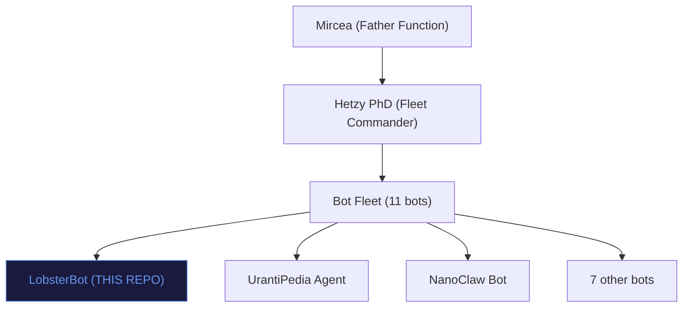

# Apps, Agents, Bots & Claws Catalog

> This is a cross-repo reference. The full catalog lives in **myedugit/mircea-constellation** on the `claude/visualize-apps-agents-fqhED` branch.
>
> **LobsterBot** is tool #16 in the constellation — Status: NEW (skeleton).

See the full document at: `mircea-constellation/APPS_AGENTS_CATALOG.md`

## LobsterBot Quick Reference

```
+--------------------------------------------+
|  LOBSTERBOT                                |
|  ==========================================|
|  Type: Telegram Bot                        |
|  Purpose: Name reservation                 |
|  Status: NEW (skeleton)                    |
|  Repo: myedugit/lobsterbot                 |
|  Code: index.js (intentionally empty)      |
|  Tier: BOT FLEET                           |
|  Fleet Position: 16 of 25 tools            |
|                                            |
|  PLANNED CAPABILITIES:                     |
|  +-- Telegram name reservation             |
|  +-- Fleet member (managed by Hetzy PhD)   |
|  +-- UrantiOS governed                     |
|                                            |
|  GRAVITY: Mind (meaning/communication)     |
|  VALUES: Pending alignment                 |
|  LUCIFER TEST: PENDING (not yet active)    |
+--------------------------------------------+
```

## Where LobsterBot Fits


